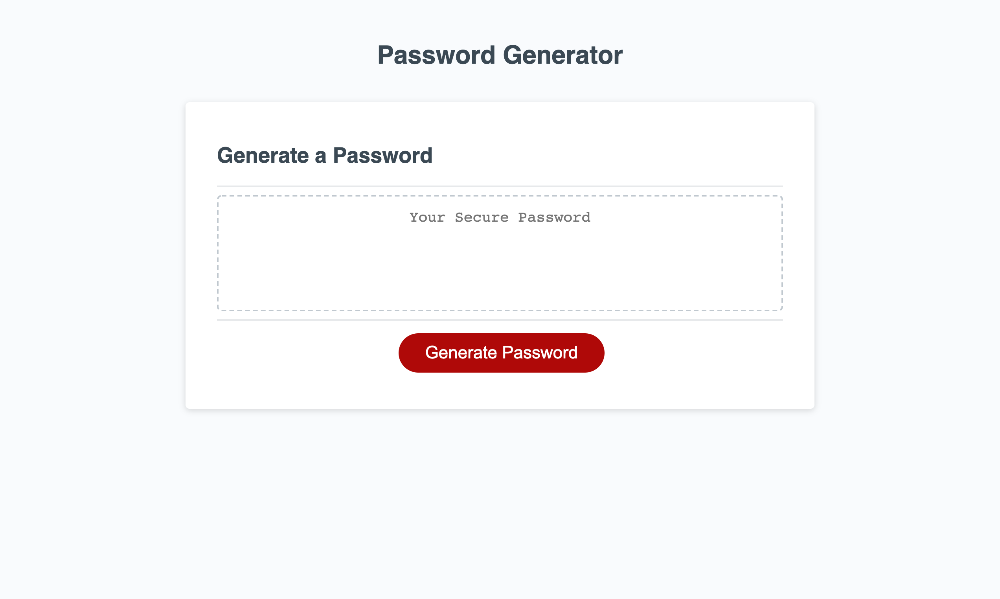

# random-password-generator

https://rjpotere.github.io/random-password-generator/

This application will provide users with a randomly generated password by selecting certian password variables.

The main mage prompts the user to select, generate password. 

When the generate password button is clicked, the user will see the following prompt.

Once the user enters the length of their password, they are asked a series of questions on password criteria.

